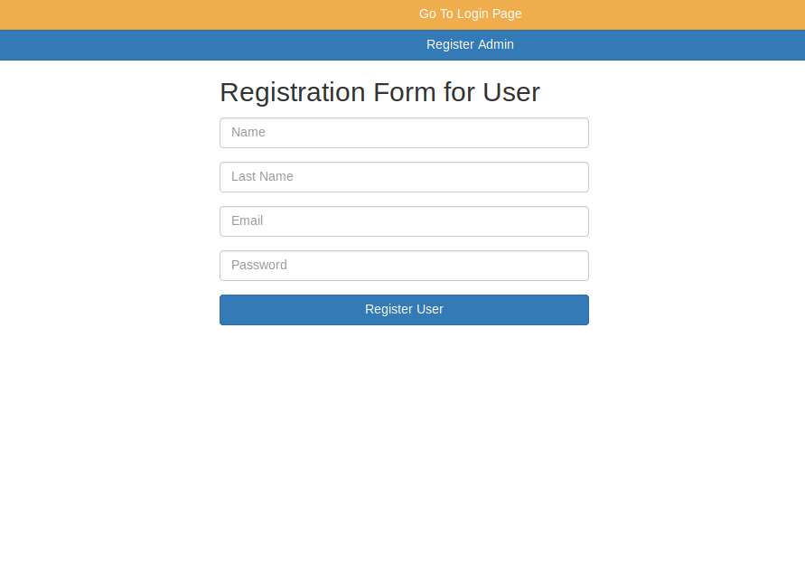
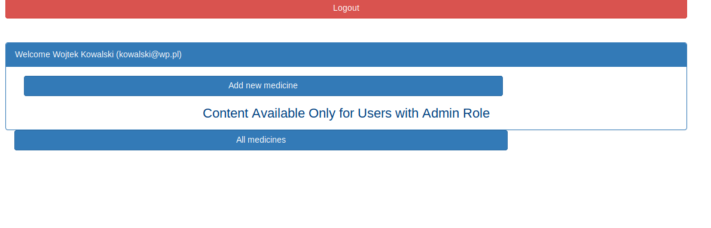
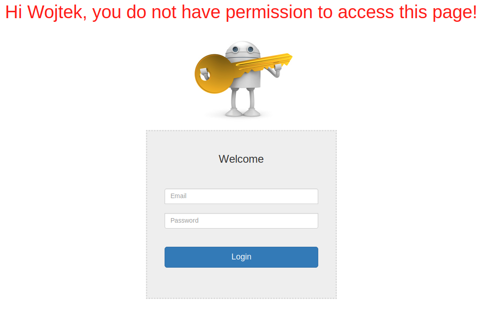
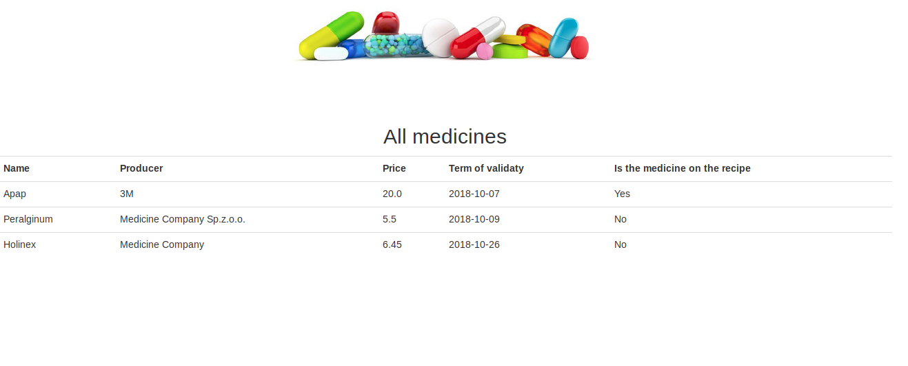

<<<<<<< HEAD
# Spring Security Login Tutorial

Tutorial / Full Information
https://medium.com/@gustavo.ponce.ch/spring-boot-spring-mvc-spring-security-mysql-a5d8545d837d

1. mvn clean
2. mvn clean install
3. Go to the target folder
4. java -jar login-0.0.1-SNAPSHOT.jar

- http://localhost:8080/registration
- http://localhost:8080/login
=======
# PHARMACY

PROJEKT STRONY INTERNETOWEJ OBSŁUGUJĄCEJ APTEKE

 ## Funkcjonalności:

-Strona działa na zasadzie przydzielonych ról różnym
użytkownikom

-Dodawanie leków możliwe tylko dla admina

-Dane użytkownika zapisywane są w bazie danych, hasło jest
hashowane

## Technologie:
 
 spring-boot , spring-security, spring-data-jpa, hibernate, thymeleaf, mysql-database, spring-validation
 
 ## Screen:
 

>>>>>>> 16b7f3ce0d02d580b7b304b4c4110d62b49d1472
