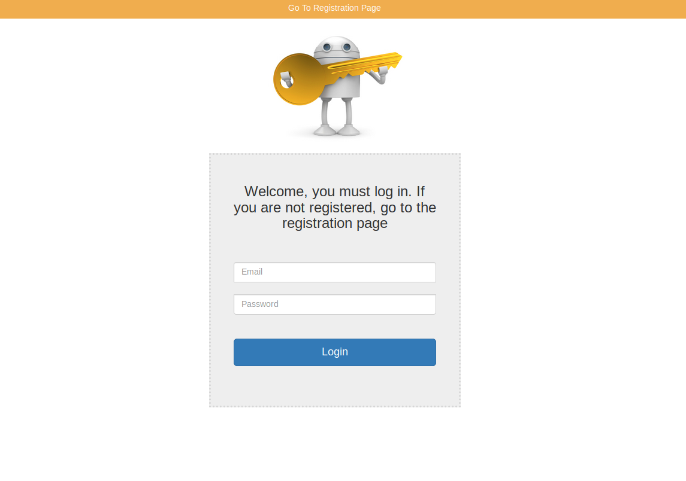

# RENT A HOUSE

PROJEKT STRONY INTERNETOWEJ OBSŁUGUJĄCEJ APTEKE

 ## Funkcjonalności:

-Strona działa na zasadzie przydzielonych ról różnym
użytkownikom

-Dodawanie leków możliwe tylko dla admina

-Dane użytkownika zapisywane są w bazie danych, hasło jest
hashowane

## Technologie:
 
 spring-boot , spring-security, spring-data-jpa, hibernate, thymeleaf, mysql-database, spring-validation
 
 ## Screen:
 

